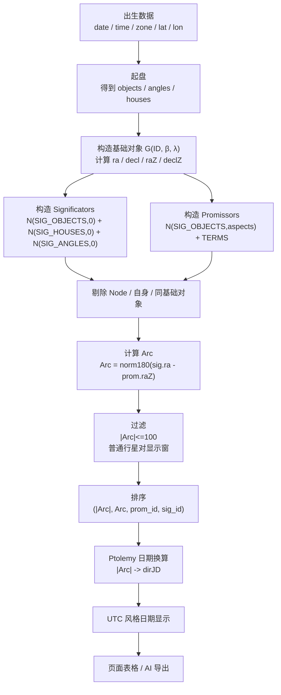

# AstroApp-Alchabitius 主限法数学版与流程图

这份文档是对
[PRIMARY_DIRECTION_ASTROAPP_ALCHABITIUS_REPLICATION.md](/Users/horacedong/Desktop/Horosa-Primary%20Direction%20Trial/PRIMARY_DIRECTION_ASTROAPP_ALCHABITIUS_REPLICATION.md)
的补充。

上一份文档偏“工程落地说明”。  
这一份只做两件事：

1. 用尽量干净的数学符号把当前复刻核写清楚
2. 用流程图把“出生数据 -> Arc -> dirJD -> 日期 -> 页面显示”串起来

## 1. 当前复刻的本质

当前 Horosa 中 `AstroAPP-Alchabitius` 分支，不是直接调用原版 flatlib 的 proportional semi-arc `arc()` 结果，而是使用一个专门对齐 AstroApp 的简化核：

```text
Arc = norm180( RA_true(sig) - RA_zero(prom_aspected) )
```

再叠加：

- 对象集构造
- Node 排除
- 显示窗过滤
- `|Arc|` 排序
- Ptolemy 日期换算

这意味着当前复刻的“圣杯”不是传统书上的第三法比例修正值，而是这个最终排序前的 `Arc`。

## 2. 三套坐标层

这里要严格区分三层：

### 2.1 黄道坐标

一个对象最基础的输入是：

- 黄经 `λ`
- 黄纬 `β`

在 Horosa / flatlib 里，对象底层先以黄道位置存在。

### 2.2 赤道坐标

从黄道坐标转赤道坐标，得到：

- 赤经 `RA`
- 赤纬 `δ`

当前底层实际用的是：

```python
eq = swisseph.cotrans([lon, lat, 1], const.ECLI2EQ_OBLIQUITY)
return (eq[0], eq[1])
```

也就是：

```text
(RA, δ) = EqCoords(λ, β)
```

### 2.3 zero-lat 赤道坐标

对同一个黄经 `λ`，如果强行把黄纬归零：

```text
(RAz, δz) = EqCoords(λ, 0)
```

那么会得到另一套赤道坐标。

这就是当前工程里 `ra` 和 `raZ` 的差别：

- `ra`：用真实黄纬算出来的赤经
- `raZ`：把黄纬置零后算出来的赤经

## 3. 对象构造公式

底层通用对象构造函数等价于：

```text
G(ID, β, λ):
    (RA,  δ ) = EqCoords(λ, β)
    (RAz, δz) = EqCoords(λ, 0)   if β != 0
                 (RA, δ)         if β == 0
```

输出字段：

- `id`
- `lat = β`
- `lon = λ`
- `ra = RA`
- `decl = δ`
- `raZ = RAz`
- `declZ = δz`

## 4. 各类 promissor / significator 的数学定义

### 4.1 N: conjunction / opposition

对对象 `X(λ, β)`：

```text
N(X, a):
    λ' = λ + a
    β' = β
```

其中：

- `a = 0` 表示合相点
- `a = 180` 表示对冲点

### 4.2 D: dexter aspect

```text
D(X, a):
    λ' = λ - a
    β' = β
```

### 4.3 S: sinister aspect

```text
S(X, a):
    λ' = λ + a
    β' = β
```

### 4.4 T: term / bound

对 `sign` 内对应界主 `ID` 的界起点黄经 `λ_term`：

```text
T(ID, sign):
    λ' = λ_term
    β' = 0
```

### 4.5 A / C: antiscia / contra-antiscia

这两者的经纬转换由对象自身的 `antiscia()` / `cantiscia()` 给出：

```text
A(X) = antiscia(X)
C(X) = contra_antiscia(X)
```

再送入通用 `G(...)` 构造。

## 5. 当前 AstroApp 对齐分支的对象集

### 5.1 Significators

```text
SIG =
  N(SIG_OBJECTS, 0)
  ∪ N(SIG_HOUSES, 0)
  ∪ N(SIG_ANGLES, 0)
```

当前代码里：

- `SIG_OBJECTS`
  - Sun, Moon, Mercury, Venus, Mars, Jupiter, Saturn
  - Pars Fortuna
  - North Node, South Node
  - Dark Moon, Purple Clouds
  - Uranus, Neptune, Pluto
- `SIG_HOUSES = []`
- `SIG_ANGLES = [Asc, MC]`

但在 AstroApp 对齐核里，Node 最终会被剔除。

### 5.2 Promissors

```text
PROM =
  N(SIG_OBJECTS, ASPECTS)
  ∪ TERMS
```

当前 `AstroAPP-Alchabitius` 分支明确不包含：

- `A(SIG_OBJECTS)`：映点
- `C(SIG_OBJECTS)`：反映点

这些对象仍属于 Horosa 原版主限法对象集，但不再属于 AstroApp 对齐分支。

其中 `ASPECTS = {0, 60, 90, 120, 180}`。

## 6. AstroApp-Alchabitius 核心 Arc

## 6.1 最终 Arc

对任意一对：

- `prom`
- `sig`

当前复刻核用：

```text
Arc_raw = RA_true(sig) - RA_zero(prom)
Arc = norm180(Arc_raw)
```

其中：

```text
norm180(x) = ((x + 180) mod 360) - 180
```

### 6.2 为什么是 sig.ra 和 prom.raZ

当前 Horosa 复刻 AstroApp 时，经验上最稳定、误差最小的是：

- 应星保留真实黄纬
- 迫星在相位化之后，用零黄纬赤经

也就是：

```text
sig -> ra
prom -> raZ
```

不是：

- `ra - ra`
- `raZ - raZ`
- 原版 flatlib semi-arc `arc(prom, sig, mc, lat)`

## 6.3 converse 的数学含义

因为 `norm180` 会返回负值，所以 converse 直接体现在 Arc 的符号里：

- `Arc > 0`：direct
- `Arc < 0`：converse

不需要在这条复刻核里单独再跑一遍“传统 converse”几何。

## 7. 过滤条件

## 7.1 基础过滤

给定 `prom_id`, `sig_id`, `Arc`，当前复刻核先做：

```text
if prom_id == sig_id: drop
if base_object(prom_id) == base_object(sig_id): drop
if |Arc| <= ε: drop
if |Arc| > 100: drop
```

其中：

- `ε ≈ 1e-12`

## 7.2 AstroApp 普通行星对显示窗

只对“普通行星 -> 普通行星”这类行追加：

```text
raw_delta = lon(sig) - lon(prom)
```

保留规则：

```text
if |raw_delta| <= 3.0: keep
elif Arc > 0 and 3.0 < raw_delta < 107.5: keep
elif Arc < 0 and -107.5 < raw_delta < -3.0: keep
else: drop
```

这里的 `lon(sig)` 和 `lon(prom)` 都是黄经。

注意：

- 这个规则是 AstroApp 页面显示逻辑复刻
- 不是阿尔卡比提乌斯经典几何本身

## 8. 排序

最终输出排序：

```text
sort by:
1. |Arc|
2. Arc
3. promittor_id
4. significator_id
```

即：

```python
key = (abs(arc), arc, prom_id, sig_id)
```

这个排序直接决定页面顺序。

## 9. Ptolemy 日期换算

## 9.1 不是简单固定回归年乘法

当前实现不是：

```text
dirJD = birthJD + |Arc| * 365.2421904
```

而是：

1. 先取整年数
2. 跳到出生的第 `years` 个周年日
3. 再按下一周年跨度做线性插值

### 9.2 公式

令：

```text
a = |Arc|
n = floor(a)
f = a - n
```

又设：

- `B_local` = 出生时刻的本地时区 datetime
- `B_utc` = `B_local` 转 UTC
- `Anniv(n)` = `B_local` 的第 `n` 个周年日
- `Anniv(n+1)` = 下一周年日

则：

```text
WholeDays = UTC(Anniv(n))   - UTC(B_local)
SpanDays  = UTC(Anniv(n+1)) - UTC(Anniv(n))
dirJD     = birthJD + WholeDays + f * SpanDays
```

这里的减法都换成天数。

### 9.3 converse 的日期

当前实现对 converse 也是：

```text
dirJD = F(|Arc|)
```

所以 converse 不会被换算到出生前。

## 10. 最小独立复刻算法

下面这版是“脱离 Horosa 页面也能自己实现”的最小数学流程：

```text
Input:
  birth data
  chart parameters
  aspect set = {0, 60, 90, 120, 180}

Step 1: build chart objects in ecliptic coordinates

Step 2: for every required object/aspect/term/antiscia/cantiscia,
        build:
          lon, lat, ra, decl, raZ, declZ

Step 3: build significator set SIG

Step 4: build promissor set PROM

Step 5: remove Node rows if target is current AstroApp-aligned branch

Step 6: for each prom in PROM:
          for each sig in SIG:
            if same-id: skip
            if same-base-object: skip
            Arc = norm180(sig.ra - prom.raZ)
            if |Arc| <= eps: skip
            if |Arc| > 100: skip
            if plain-planet-pair:
               apply raw_delta display window
            keep row

Step 7: sort by (|Arc|, Arc, prom_id, sig_id)

Step 8: map dirJD from |Arc| using anniversary interpolation

Step 9: render date in UTC-like display
```

## 11. 流程图



## 12. 与原版 flatlib 主限法的关系

原版 flatlib 的 In Zodiaco 主限法核心是 proportional semi-arc：

```text
arcz = arc(prom.raZ, prom.declZ, sig.raZ, sig.declZ, mcRA, lat)
```

当前 AstroApp 对齐分支不是直接用这条 `arcz`。

这是最容易让人走偏的一点：

- 原版 Horosa / flatlib
  - 更接近传统主限实现
- 当前 AstroApp 复刻核
  - 是一个“经验拟合 + 页面过滤 + 日期换算”的工程实现

所以如果你的目标是“复刻当前 Horosa 中 AstroAPP-Alchabitius 这一分支”，请用本文档的核，不要回退去套原版 `arc()`。

## 13. 当前工程内的验证锚点

想验证你的独立实现有没有跑偏，可以直接对照当前仓库：

- 实现说明：
  - [PRIMARY_DIRECTION_ASTROAPP_ALCHABITIUS_REPLICATION.md](/Users/horacedong/Desktop/Horosa-Primary%20Direction%20Trial/PRIMARY_DIRECTION_ASTROAPP_ALCHABITIUS_REPLICATION.md)
- 回归统计：
  - [/Users/horacedong/Desktop/Horosa-Primary Direction Trial/runtime/pd_reverse/selfcheck_astroapp60_summary.json](/Users/horacedong/Desktop/Horosa-Primary%20Direction%20Trial/runtime/pd_reverse/selfcheck_astroapp60_summary.json)
  - [/Users/horacedong/Desktop/Horosa-Primary Direction Trial/runtime/pd_reverse/uicheck_rows_120_summary.json](/Users/horacedong/Desktop/Horosa-Primary%20Direction%20Trial/runtime/pd_reverse/uicheck_rows_120_summary.json)
  - [/Users/horacedong/Desktop/Horosa-Primary Direction Trial/runtime/pd_reverse/local_backend_vs_astroapp_rows_all300_after_displayfilter_summary.json](/Users/horacedong/Desktop/Horosa-Primary%20Direction%20Trial/runtime/pd_reverse/local_backend_vs_astroapp_rows_all300_after_displayfilter_summary.json)

## 14. 结论

如果只保留一句公式，当前这套 AstroApp 对齐核就是：

```text
Arc = norm180( RA_true(significator) - RA_zero(promissor_after_aspect) )
```

然后：

```text
dirJD = PtolemyAnniversaryInterpolation(|Arc|)
```

最后再做：

- 显示窗过滤
- `|Arc|` 排序
- UTC 风格日期展示

这三步缺一不可。
