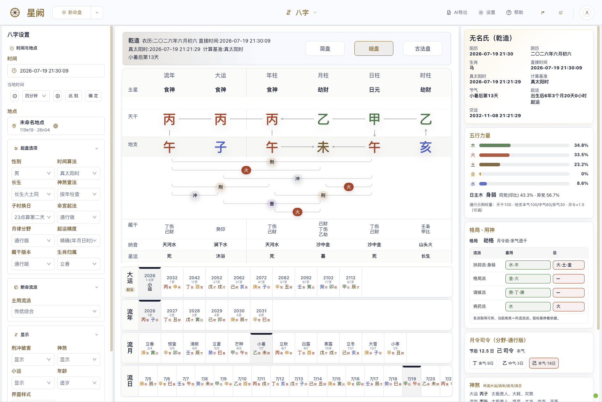
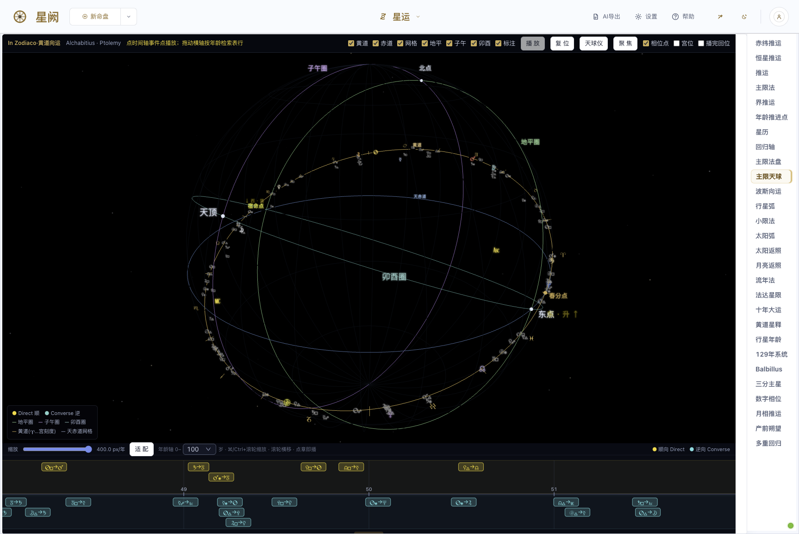
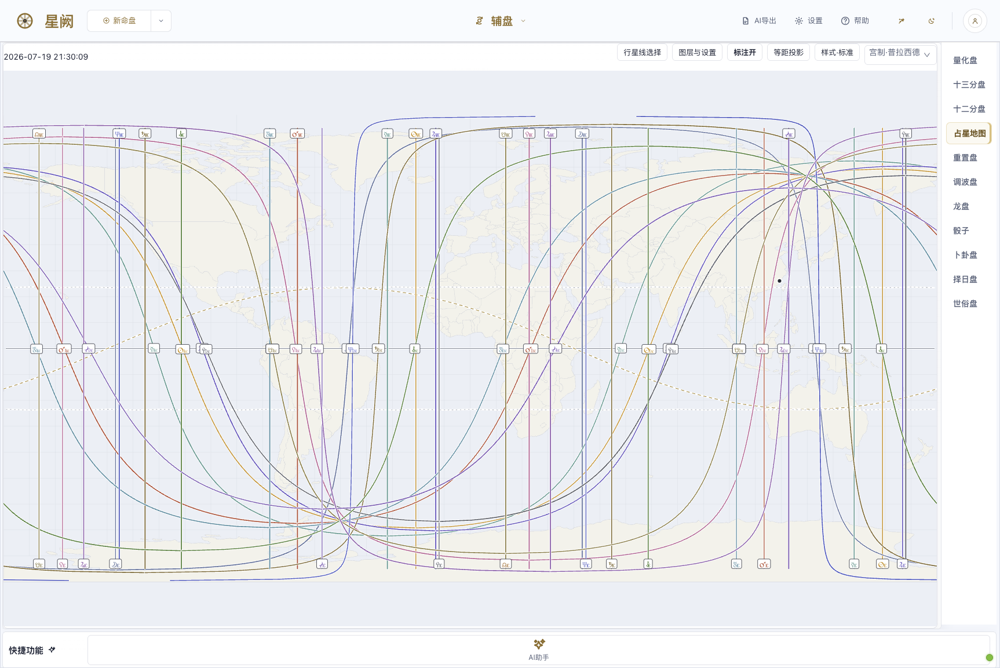
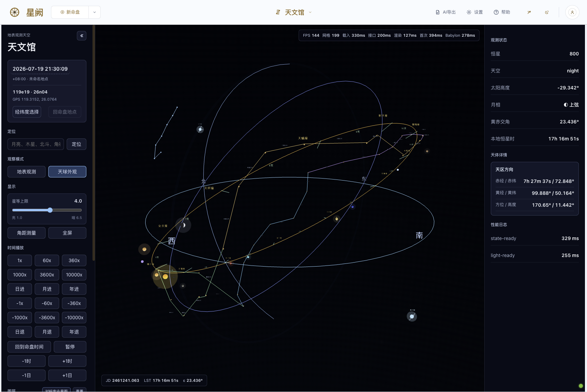
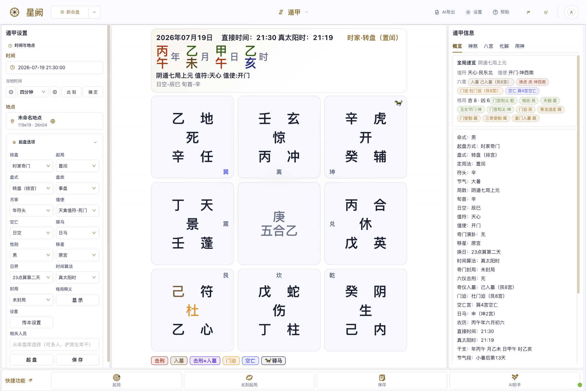
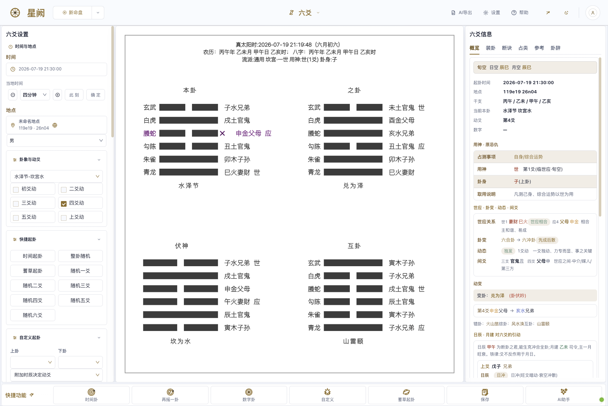
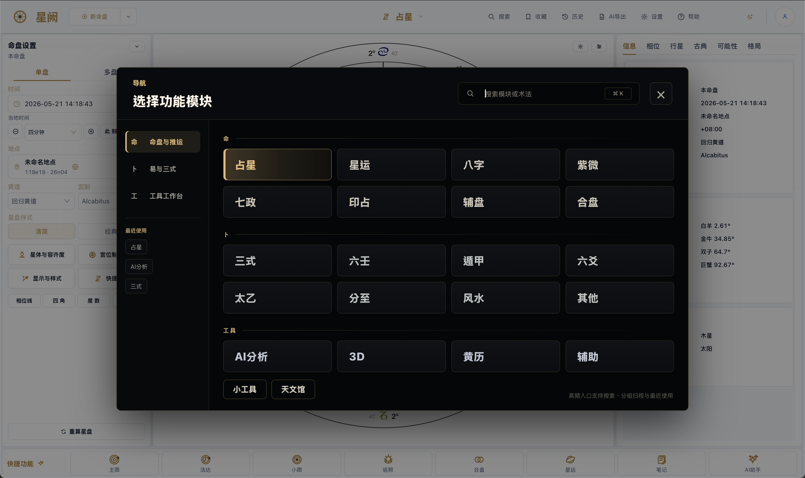

[简体中文](README.md) · English

# Horosa 星阙

**Every kind of metaphysics, in one native macOS app** 
*把所有玄学放进一个原生 macOS 软件里*

Three workspaces — **Fate (命) · Divination (卜) · Tools (工具)** — **26 primary disciplines, 60+ sub-techniques and schools** (full catalog in [What's Inside](#3-whats-inside))

[Download the installer](https://github.com/Horace-Maxwell/Horosa-Web-App-comprehensively-improved-MacOS/releases/download/v3.11.3/Horosa-Installer-macos-arm64-offline.pkg) ·
[Chinese portal](README.md) ·
[中文详版](README_ZH.md) ·
[All releases](https://github.com/Horace-Maxwell/Horosa-Web-App-comprehensively-improved-MacOS/releases)

---

## Contents

1. [What Horosa Is](#1-what-horosa-is)
2. [Technology Stack](#2-technology-stack)
3. [What's Inside (Fate / Divination / Tools)](#3-whats-inside)
4. [Download & Install](#4-download--install)
5. [Run the Web Version from Source](#5-run-the-web-version-from-source)
6. [FAQ](#6-faq)
7. [License & Third-Party Notices](#7-license--third-party-notices)
8. [Acknowledgements](#8-acknowledgements)
9. [Documentation & Entry Points](#9-documentation--entry-points)

---

## 1. What Horosa Is

Horosa is a desktop workstation for metaphysics and divination that puts almost every traditional art inside a single native macOS application. Western astrology (natal charts, the full timing chain, relationship charts) sits next to the Chinese systems (Bazi, Ziwei, Qimen, Liuren, Taiyi, Liuyao, Feng Shui, Qizheng Siyu), Vedic astrology, Hellenistic astrology, Hamburg-school quantitative charts, Tarot, geomancy and more — with built-in multi-LLM AI analysis on top.

The goal: **stop hopping between a dozen single-purpose web chart calculators, and never hand-assemble the Python / Java / ephemeris runtime underneath.** Download one signed, notarized, offline installer and open a finished app.

This repository is the macOS delivery of that app: the application source, the shared runtime, the Tauri desktop shell, and the release pipeline that turns all of it into a single `.pkg`.

- **Current version**: 3.11.3 (runtime `3.11.3-runtime1`)
- **Platform**: macOS 12+ on Apple Silicon (`arm64`) only
- **License**: AGPL-3.0-only

### Screenshots

<table>
<tr>
<td width="50%"> <b>Astrology (Western natal chart)</b> — chart parameters and school presets on the left, the wheel canvas in the center, and Info / Aspects / Planets / Classical / Patterns tabs on the right.</td>
<td width="50%"> <b>Bazi</b> — simple / detailed / classical plates, five-element strength, pattern and useful god, monthly commander, with linked major luck / annual / monthly / daily periods.</td>
</tr>
<tr>
<td width="50%"> <b>Vedic astrology</b> — D1–D60 divisional charts side by side, South / North / East Indian styles, Chitrapaksha ayanamsa, and Shashtiamsa dignities.</td>
<td width="50%"> <b>Primary directions · celestial sphere</b> — ecliptic / equator / horizon / meridian / prime vertical rendered in 3D, with an event timeline that looks up table rows by age.</td>
</tr>
<tr>
<td width="50%"> <b>Astrocartography (ACG)</b> — planetary ASC / MC / DSC / IC lines projected on a world map, equidistant projection and switchable house systems.</td>
<td width="50%"> <b>Planetarium</b> — ground-observer and celestial-sphere modes, real-time stars, obliquity, sidereal time, a Babylon.js 3D sky.</td>
</tr>
<tr>
<td width="50%"> <b>Sanshi United</b> — Taiyi / Liuren / Qimen on one screen, the nine-palace plate with Overview / Taiyi / Liuren / Qimen / Ziwei Sihua tabs.</td>
<td width="50%"> <b>Qimen Dunjia</b> — hour-based rotating plate with intercalation, stars / doors / deities / stems in nine palaces, Overview / Shensha / Eight Palaces / Remedies / Useful-god tabs.</td>
</tr>
<tr>
<td width="50%"> <b>Da Liuren</b> — three transmissions, four lessons and the twelve generals, with pattern / Bifa / judgement / imagery / Qizheng readings across schools.</td>
<td width="50%"> <b>Liuyao (Najia)</b> — original / changed / hidden / nuclear hexagrams, dynamic intervening lines by Shi-Ying position, with casting / verdicts / question types / hexagram texts.</td>
</tr>
<tr>
<td width="50%"> <b>Astrological geomancy</b> — the sixteen figures in a shield chart: mothers / daughters / nieces / judge / reconciler, with planet-in-house readings.</td>
<td width="50%"> <b>Almanac (Huangli / Tongshu)</b> — traditional suitable / unsuitable activities, duty deity and mansion, Pengzu taboos, auspicious and inauspicious spirits, clash directions, fetal-god position, and date selection.</td>
</tr>
</table>

<em>Navigation overlay — charts & timing, Yi & Sanshi, and tool workbenches grouped together, with search and recents.</em>

---

## 2. Technology Stack

| Layer | Technology | Notes |
| --- | --- | --- |
| Desktop shell | **Tauri 2 (Rust)** | Native shell: lifecycle / windows / runtime bootstrap / in-app updates / zoom persistence; Developer ID signed + Apple notarized; the offline runtime ships inside the package |
| Frontend | **React 17 + UMI 3 + TypeScript / JS**, Ant Design | D3 chart drawing, Babylon.js / Three.js 3D, Plotly astro-maps, Monaco editor for AI export templates |
| Backend (business) | **Java 17 / Spring Boot 2.7** (multi-module Maven) | Hosts the core astrology and Chinese-method services; listens on `:9999` (request bodies RSA-encrypted); heavy computation is forwarded to Python |
| Backend (computation) | **Python 3.9** | Wraps Swiss Ephemeris (`pyswisseph`) + flatlib (modified) + vendored traditional-method engines; CherryPy REST on `:8899` |

**Port conventions**: frontend ↔ Java `:9999` (RSA-encrypted envelope); Java ↔ Python `:8899`; the frontend's static port is allocated dynamically (multiple instances never collide).

---

## 3. What's Inside

The navigation groups every module under three headings: **Fate (命)** — charts and timing, **Divination (卜)** — the Yi and the Three Formulae, and **Tools (工具)**. Module names map one-to-one onto the tabs inside the app.

### Fate (命) · Charts and Timing

The strength of this layer is continuity: read a natal chart, walk it forward through time, then bring in a second person — all on the same surface.

#### Astrology (Western natal chart)
- Tropical / sidereal natal charts; chart parameters on the left, a D3 wheel in the center, multi-tab details on the right.
- **One-click school presets** (plus custom): Brennan / Valens / Ptolemy / Dykes / Houlding / Zoller — each preset sets zodiac, house system, bounds and triplicities together; the default Brennan preset is the zero-regression baseline.
- **Zodiacs**: tropical plus many sidereal ayanāṃśas (mainstream Indian family / true-star calibrated / Western sidereal / galactic / historical Babylonian + epochs).
- **House systems**: Whole Sign, Alcabitius, Koch, Porphyry, Equal, Meridian, Sunshine, Pullen SD/SR, APC, Whole Sign from the Part of Fortune, and more.
- **Bounds**: Egyptian (default) / Ptolemaic / Lilly. **Triplicities**: Dorothean (default) / Ptolemaic / Ptolemaic water variant.
- **Classical parameters** (the "Classical" tab): sect, out-of-bounds, planetary joys, hayz, feral, lunar mansions, Thema Mundi, derived houses, eminence, klimata.
- **Right-hand tabs**: Info / Aspects / Planets (+ Hellenistic Lots) / Classical / Possibilities / Patterns / Egyptian.
- **3D chart** (Babylon.js, same data source as the 2D wheel), **astro-map / astrocartography (ACG)** with map point picking.
- **AI / storage**: the bottom quick dock jumps to each timing technique; multiple snapshot types; save as a chart record, add notes.

#### Timing (the directions hub)
- **Primary directions**:
  - **Core methods**: Alcabitius (default) / Meridian / Porphyry / Equal Ecliptic / Equal Hour Circle.
  - **Direction types**: in zodiaco (default) / in mundo.
  - **Motion**: direct / converse / both; **promissors**: antiscia / terms (bounds).
  - **Time keys**: Ptolemy (default), Naibod, Cardano, Umar, Wöllner, Plantiko, true solar arc, symbolic solar arc, synodic year, Kepler, Brahe and more.
- **Other timing techniques** (each on its own sub-page or tab): solar arc, Firdaria, profections, solar return, lunar return, decennials, decennial segments, zodiacal releasing, planetary ages, Vedic progressions, Jaynes secondary progressions, planetary arc, Persian directions, the 129-year system, Balbillus, triplicity lords, key points, lunar-phase progressions, other returns, prenatal syzygy, the secondary-progression hub, return timeline, distributions, age-point, and the ephemeris.

#### Bazi (Four Pillars)
- Four-pillar charting runs on the frontend's local engine; ten gods, five-element strength, stem and branch readings on two layers.
- **School selector for interpretation**: classic synthesis (default) / support-restrain / pattern / seasonal adjustment / disease-remedy / blind school / Nayin classical.
- **Reading layers**: life-palace numerology, five-element prosperity, patterns (regular / variant / miscellaneous), three schools of useful god (support-restrain / pattern / seasonal adjustment + disease-remedy / mediation), monthly commander, complete Shensha, nominal / actual age, blind-school structure, Nayin classical plate.
- **Timing**: major luck / annual / monthly / daily / hourly / minor luck (Cartesian combinations of several period levels); the Shensha panel follows the selected period.

#### Ziwei (Purple Star astrology)
- Twelve-palace natal chart (default output is byte-for-byte stable; any variant switch runs the frontend's local engine as a second path).
- **Sihua (four transformations) schools**: common Feixing (default base table) / Quanshu lineage / Zhongzhou school / Northern school · general Feixing / Feixing school / Tou school.
- **Divergence switches**: major-limit span, Tianma basis, star set, three plates, Tianshang / Tianshi (fixed / yin-yang swap), leap month, late Zi hour, year boundary, Huo / Ling (triple-harmony / Southern school), Kong / Jie naming.
- Heaven / Earth / Human plates, localized patterns (with verdicts / sources / breaking conditions), a long-life label layer.
- **Timing (luck periods)**: major limit / annual (incl. minor limit) / monthly / daily / hourly; stacked Sihua cards up to 3 layers (self-transformation only when no period is selected).

#### Qizheng (Qizheng Siyu / Guolao)
- The 28-mansion degree system + the seven governors (Sun, Moon, Mercury, Venus, Mars, Jupiter, Saturn) + the four remainders (Rahu / Ketu / Ziqi / Yuebei).
- **Two engines**: Horosa's own / Kinastro (Qizheng). **Mansion degree systems**: true sidereal / classical tables / equatorial tropical.
- Dignities, transformations, true / mean nodes, Yuebei true / mean apogee, exaltation degrees, time-telling star in true / mean / apparent solar time.
- **Major limits**: Dongwei (co-rotation) / Yumao (classical progressive). Natal and annual Shensha. Three plate views (ring major-limit plate / curated plate / Qizheng diagram).

#### Vedic astrology (Jyotish)
- North / South / East Indian chart styles with clockwise / counter-clockwise mirroring; many house systems and the same ayanāṃśa family as the Western module.
- **Vargas**: D1 Rashi … D60 (mainstream divisional charts + a divisional grid).
- **Dashas**: Vimshottari (default, 120 years) + Yogini (36) / Ashtottari (108) / KP (180); mahadasha / antardasha / third-level sub-periods; Naisargika natural dasha.
- Automatic Yoga detection, 27 Nakshatras, Shadbala, Ashtakavarga, Vimsopaka, KP (true Placidus system with corrections), Tajika / Argala / Gochara, Muhurta / Choghadia electional timing, octants, six-seat progressions, multi-school toolkits.

#### Auxiliary charts
- **Quantitative / Hamburg school**: four schools = classic / pure / Uranian (American symmetrical) / cosmobiology; 90° (or 45°) dial, midpoint trees, midpoint aspects, six-house frames, graphic ephemeris, trans-Neptunian points (TNPs), rectification, cosmogram.
- **Hellenistic**: the thirteen-division chart (13th harmonic; bounds / Arabic parts).
- **Twelfth-parts, astrocartography / relocation chart, harmonic charts (N-th), Draconic chart, horary charts (five schools), electional charts, mundane charts.**

#### Relationship charts
- Comparison (bi-directional aspects / midpoints / antiscia) / composite (a third chart from midpoints) / synastry (inner and outer rings) / time-space midpoint / Marks chart, plus quantitative relationship scoring.

#### Numerology (Shushu)
- Shaozi Shenshu / Tieban Shenshu (the "hooking" method + major luck) / Guigu Fendingjing (two-headed pincers) / Beiji Shenshu / Nanji Shenshu / Chunzi Shu / Shaozi Canping Shu (golden lock and silver key) / Heluo Lishu (pre- and post-heaven trigrams with line texts).

#### Other (Fate)
- Yanqin / Wanhua Xianqin (three palaces / star-bird / devouring); Cetian Feixing (18 stars, two schools: book method / original method).

### Divination (卜) · The Yi and the Three Formulae

The Yi and the Three Formulae are more than independent tabs: Sanshi United is a genuinely working integrated surface.

#### Sanshi United (the Three Formulae together)
- Qimen + Taiyi + Liuren presented on one surface, **same input, same result and same rich display** as each standalone page.
- Quick tabs: Overview / Taiyi / Liuren / Qimen (right-hand rich display aligned with the standalone pages); every school option matches the standalone page (local Qimen plate methods of each lineage, monthly-formula plate setting, Taiyi time basis).

#### Qimen Dunjia
- Plate-setting methods (intercalation / split-and-supplement / Maoshan / no-leap / yin-plate by number); plate styles (rotating / flying / hybrid); hour / day / month / year formulae; void and post-horse (day / hour); duty envoy.
- Useful-god selection (basic + lookup + generation/control classes); eight-palace panel.

#### Da Liuren
- Four lessons, three transmissions + the 64 lesson classics (lesson bodies).
- Five noble-person methods, three monthly-general schools, three day/night divisions, harm-involvement selection (with boundary conventions), major patterns, minor situations, Bifa (a 64-lesson matching library), a Qizheng Siyu sub-page.
- **AI / storage**: school-aware mounted snapshots (with export supplements).

#### Liuyao (Najia hexagrams)
- A full-layer engine; **school presets + custom**: general / Zengshan Buyi · Yehe / Bushi Zhengzong / Yiyin / Shao Weihua's new school / blind school / custom.
- Casting methods: coins / yarrow stalks / time (Meihua) / numbers / manual; verdict settings (question type / monthly break / earth long-life / changing-line range / hexagram body / flying-hidden / changed-hexagram installation / Shensha / six beasts / year boundary); original / nuclear / changed / inverse / reversed hexagrams.

#### Taiyi (Taiyi Shenshu)
- Accumulated years for the reckoning deity (several classical constants); plate styles (hour / year / month / day / minute reckoning + fate-method layouts); host–guest reckoning geometry (default / plus one palace / without); pattern win-lose; field allocation; the deities' reckonings (several numerical classes).
- **School overlay layer** (multi-axis switches, derived purely on the frontend); fate-method specialization; major and minor limits. Palace highlighting + pattern lines + click-through panels.

#### Solstices & Equinoxes (solar-term chart)
- The 24-solar-term chart + tropical / sidereal planetary positions + solar-term times.

#### Feng Shui
- **Two families, eight schools**: floor-plan residential (Naqi plate method / Bagua residential method); compass-based Liqi charting (Bazhai · Da Youmian / Xuankong Feixing / Sanhe · twelve-stage water method / Jinsuo Yuguan / Qiankun Guobao / Zibai Feixing).
- Advanced Xuankong (replacement trigram with inclined facing / city gate / seven-star robbery / monthly stars); period / sitting-facing / annual & monthly / water mouth / sitting trigram / fate.

#### Other (Divination)
- **Mansion divination** (28 / 27 lunar mansions + mansion lord + Nayin), **Tongshe method** (four images mapped onto the eight trigrams), **Huangji Jingshi / Huangji Guice** (four casting methods + a time-space plate), **Wuzhao** (five plate methods + five division methods), **Taixuan** (the 81 heads of the Taixuan Jing with stalk casting + reading depth), **Jingjue**, **Shenyishu**.
- **Feigong** (flying-palace charting), **Xiaochengtu** (the Great Derivation yarrow method, two- / three-division variants), **Xiao Liuren** (palm six-deity method).
- **Jinkou Jue** (several schools): noble-person systems / monthly-general replacement / plate styles; five movements and three movements / patterns / four-position generation and control / useful gods / Shensha / timing / earth division / void / Nayin.
- **Geomancy (astrological geomancy)**: the sixteen figures in a shield chart (four mothers, four daughters, four nieces + judge + reconciler + two witnesses) / figures in houses / astrological house assignment / perfection and companionship. **Several schools** (classical house assignment / planetary resonance / modern synthesis / Arabic sand divination / Indian dice divination / Sikidy / Hakata); scope L0–L4 / zodiac (classical / planetary) / casting (random / reproducible time seed / manual seed); figure-by-figure meanings.
- **Tarot**: **many decks** (the core four + BOTA / Wirth / Egyptian / Etteilla / Lenormand 36 / Grand Tableau / Kipper 36 / Sibilla 52 / playing cards 52 / Visconti / Minchiate 97); **many spreads**; reading methods (yes-no / quintessence / life card / year card / counting chains / composite narrative); variants A/B/C / reversals / one seed gives the same result across schools.

### Tools (工具) · Workbenches

#### AI Analysis
- **Multi-LLM access**: OpenAI / DeepSeek / Anthropic / Gemini / OpenRouter / Ollama (local) / Moonshot (Kimi) / Zhipu / SiliconFlow / Groq / xAI / any custom OpenAI-compatible endpoint.
- **Thinking / reasoning levels** (off / low / medium / high / xhigh / max), mapped per protocol family (Anthropic thinking budget / OpenAI reasoning effort / Gemini thinking config); vision-capable models are detected automatically.
- Streaming chat (SSE, stoppable) + conversation history + a materials library (RAG: chunking / vector embeddings / retrieval / keyword + vector re-ranking).
- **Technique mounting**: every chart-type and case-type technique, plus techniques castable from a casting time; one click mounts them all.
- **Structured export**: filter sections by technique / tab; md / html / json / csv / pdf / docx.

#### Planetarium
- Real-time 3D sky on Babylon.js. **Pure astronomy**: it borrows the house frame only — no precession-based zodiac tricks.
- Sun, Moon, planets + lunar nodes + planetary tracks; Chinese asterisms (the 28 mansions in four symbols / the three enclosures / the Big Dipper / asterisms / the Milky Way, always on their real stars); the 88 Western constellations + IAU boundaries + star names; four coordinate grids (horizon / equatorial / ecliptic / mansion degrees); scale overlays; poles and the precession circle / the analemma; magnitude filter (1.0–6.5, default 4.0); click to read coordinates / angular-distance measurement / rise, transit and set times (Bennett atmospheric refraction).

#### Almanac
- Lunar calendar dates / 24 solar terms / date selection / suitable and unsuitable activities.

#### Database
- A built-in catalog of high-confidence celebrity charts (tens of thousands of A/AA-rated birth records), fully offline with sub-second search: keyword / sign / gender / birth year / rating / category filters and sorting.
- Each entry shows a zodiac wheel (counter-clockwise, increasing longitude), life events and category tags; **one click adds it to chart management** — import any celebrity into your local chart library and cast it directly on the astrology / Bazi / Ziwei pages.

#### History of Chinese Metaphysics
- Built on public-domain classics (the Twenty-Four Histories, the Taiping Guangji and others): a compilation of figures, stories, the lineages of the arts and celestial-event records (thousands of events and tens of thousands of observations).
- An offline historical map of China + a force-directed relationship graph + a chronological timeline, searchable by dynasty / discipline / person; any historical moment can be sent straight into a chart, with the original classical text available for cross-checking.

#### Reference
- Trigram imagery / the twelve chained palaces / quick Bazi rule lookups; a true-solar-time calculator.

### Cross-technique capabilities

- **Local storage**: chart records and case records are saved locally (tags, snapshots, raw structured backend data), with JSON import / export and full state restore on reopen.
- **Chart notes** (memo), the charting configuration drawer (aspect selection / orbs / displayed bodies / chart components / chart distribution), and a small-tools drawer.

---

## 4. Download & Install

Regular users should go straight to the offline installer and open Horosa like any other macOS app.

**[⬇︎ Horosa-Installer-macos-arm64-offline.pkg](https://github.com/Horace-Maxwell/Horosa-Web-App-comprehensively-improved-MacOS/releases/download/v3.11.3/Horosa-Installer-macos-arm64-offline.pkg)**

Best for:

- Apple Silicon Macs on macOS 12 or later
- weak-network or fully offline environments
- a first install, or forwarding the package to someone else
- anyone who wants the first launch to work without a separate runtime download

You do not need to install Python or Java yourself — the runtime ships inside the package. Updates replace the program and the shared runtime; they are not designed to touch your saved charts and cases. In-app updates are incremental: components that did not change are reused, so a typical upgrade downloads only the parts that actually changed.

---

## 5. Run the Web Version from Source

Prefer running from source instead of the `.pkg`? One double-click:

- **Start**: double-click `Horosa_OneClick_Mac.command` in the repo root. With build artifacts present it opens your browser in seconds; the first run bootstraps the toolchain and builds automatically (Mongo / Redis are optional for this product and skipped by default — set `HOROSA_SKIP_DB_SETUP=0` to install them).
- **Stop**: double-click `Horosa_Stop_Mac.command` — it reclaims every port instance and only touches processes carrying this product's fingerprint, never other software.
- **Downloaded as ZIP?** GitHub's "Download ZIP" drops the executable bit — run `chmod +x *.command tools/mac/*.command scripts/mac/*.sh` once, and use right-click → Open the first time to pass Gatekeeper. `git clone` needs neither.
- **Ports busy?** It automatically falls back to free ports starting at 18899 / 19999 / 18000 — nothing to do by hand.
- All tunables (ports, skip-build flags, download mirrors, …) are documented in [docs/WEB_LOCAL_LAUNCH.md](docs/WEB_LOCAL_LAUNCH.md); mainland-China mirror fallbacks (TUNA / npmmirror) are built in.

---

## 6. FAQ

**Do I need to clone the repository to use Horosa?**
No. Download the offline installer from the latest release.

**Do I need to install Python or Java myself?**
No. The offline installer carries the complete runtime.

**Why are there other files in the release?**
The installer, the in-app updater, the notarization flow and the runtime publishing pipeline need them. For end users, the offline `.pkg` is the only thing that matters.

**Will updates remove my data?**
No. Application and runtime updates replace the program and the shared runtime; they are not designed to erase your saved charts and cases.

**Is an Intel Mac supported?**
Not at the moment — the release targets macOS 12+ on Apple Silicon (`arm64`) only.

---

## 7. License & Third-Party Notices

- **This project**: [AGPL-3.0-only](LICENSE).
- **Legal & privacy**: Terms of Service / Privacy Policy / Security / Network / Open-source notices — see [docs/legal](docs/legal/) (Chinese and English).
- **Third parties**: the complete list with license texts is in [THIRD_PARTY_NOTICES.md](THIRD_PARTY_NOTICES.md).
  - Vendored traditional-method engines: some upstreams declare MIT (license texts kept in the corresponding `Horosa-Web/vendor/*/LICENSE`); some upstreams declare no license — these are listed separately and no open-source license is assumed for them.
  - Celestial reference data from d3-celestial (BSD 3-Clause; constellation lines / IAU boundaries / Chinese three-enclosure derivations).
  - flatlib (modified).
  - Swiss Ephemeris (`pyswisseph`).

---

## 8. Acknowledgements

The lineage matters. Horosa was originally created by **郑大哥**, with **荀爽-Herakleios** contributing to the design, and they released the related App and Web versions so that others could study, learn from and extend them. This macOS edition stands on the Horosa system, the divination workflows and the spirit of open sharing they established, and continues the work: macOS delivery, runtime packaging, feature integration and experience refinements.

Special thanks to [kentang2017](https://github.com/kentang2017) for the long-running, openly shared Python projects on traditional Chinese divination — Horosa integrates or adapts several of their calculation engines. Upstreams identified as MIT-licensed keep their licenses in [`THIRD_PARTY_NOTICES.md`](THIRD_PARTY_NOTICES.md) and the corresponding vendored directories; projects without an explicit open-source declaration are listed separately, so no license is assumed where none was declared. Thanks as well to everyone who keeps testing, reporting and fixing things to make Horosa more complete.

---

## 9. Documentation & Entry Points

- Installer and release pipeline: [Horosa_Desktop_Installer/README.md](Horosa_Desktop_Installer/README.md)
- Community documents: [CONTRIBUTING.md](CONTRIBUTING.md) · [SECURITY.md](SECURITY.md) · [SUPPORT.md](SUPPORT.md) · [CODE_OF_CONDUCT.md](CODE_OF_CONDUCT.md)
- Legal & privacy: [docs/legal](docs/legal/) (Terms of Service · Privacy Policy · Security · Network · Open-source notices)
- Third-party licensing: [THIRD_PARTY_NOTICES.md](THIRD_PARTY_NOTICES.md)
- Application source: `Horosa-Web/` — frontend in `astrostudyui`, backends in `astrostudysrv` and `astropy`, vendored engines in `vendor`
- Language editions: [README.md](README.md) (Chinese portal) · [README_ZH.md](README_ZH.md) (Chinese guide)
